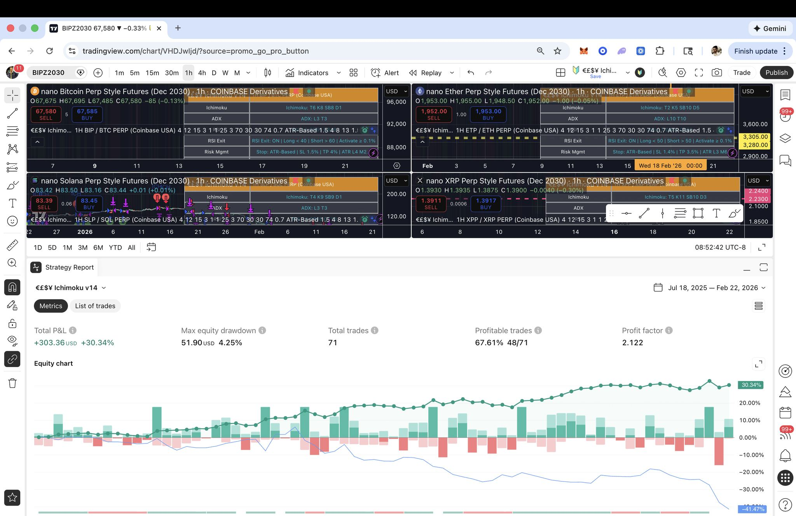
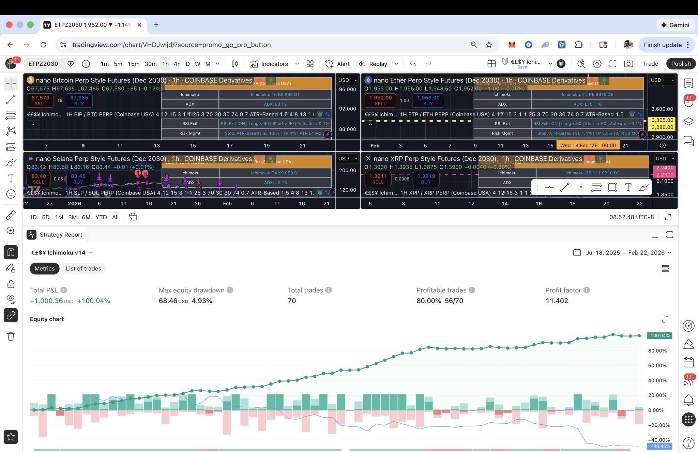
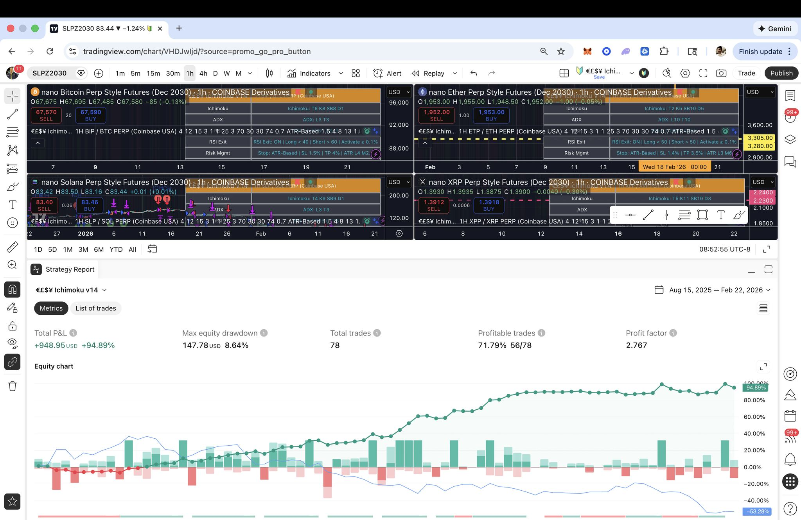
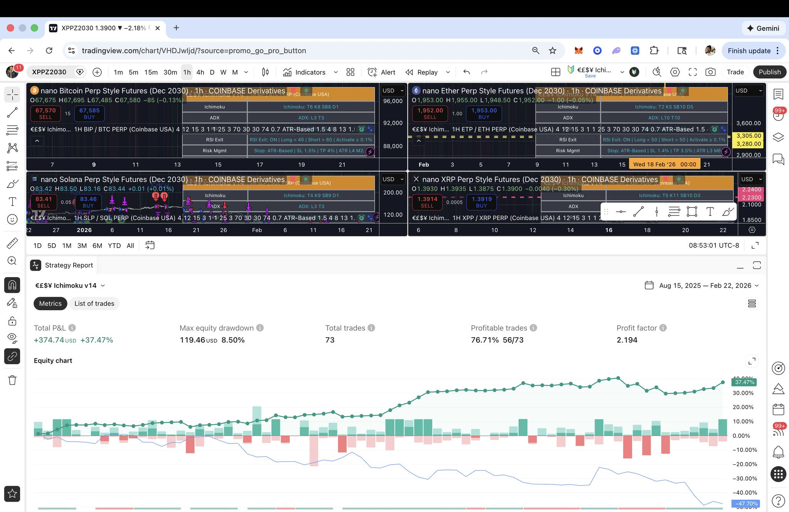
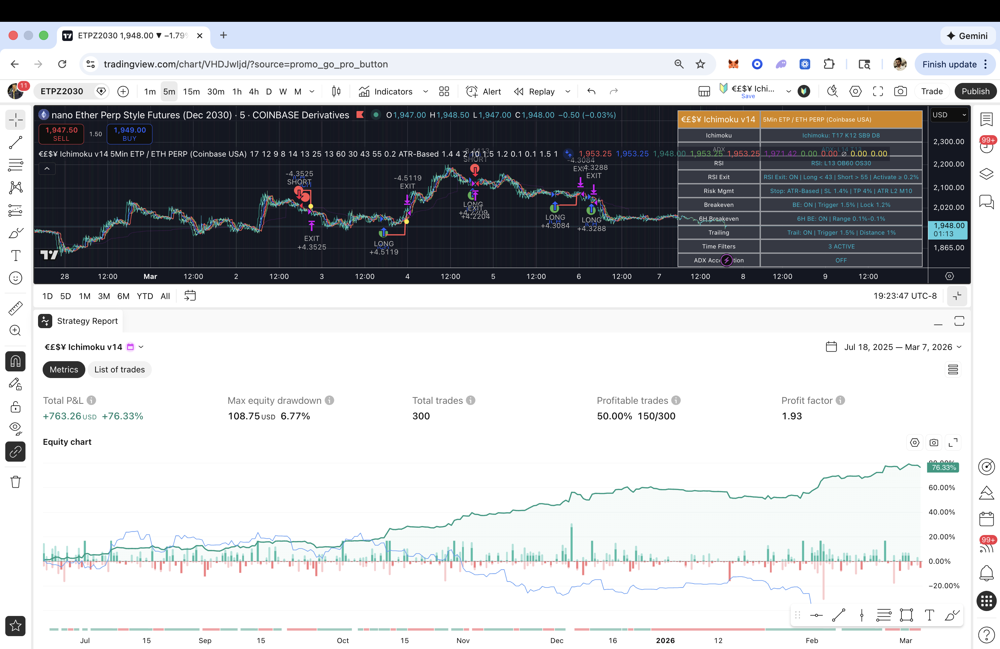

# Easy Ichimoku v14

**Last updated:** March 2026

**€£$¥ Ichimoku v14** — Production-style TradingView Pine Script (v5) implementing a preset-optimized Ichimoku Cloud trend-following system with layered filters, structured exits, and webhook-ready JSON alerts for automated execution.

Part of the **Easy Trading Software** suite.

This repository demonstrates:

- Structured forward validation methodology
- Window-normalized compounding analysis
- Portfolio partition modeling
- Production-ready alert architecture

---

# Why This Project Stands Out

- Preset-optimized per symbol (BTC, ETH, SOL, XRP — 1H & 5m)
- Multi-layer entry validation (TK cross + cloud + Chikou + ADX + RSI)
- Structured exit stack (ATR stop, TP, breakeven, 6H BE band, trailing, RSI exit)
- Time guardrails (weekend, evening, 8–9 AM PT volatility filter)
- 100+ enriched JSON fields for analytics + automation
- Designed for real webhook → execution agent deployment

This is a full production strategy — not a snippet.

---

# Reproducibility (Strategy Tester Settings)

All performance shown uses:

- Venue: Coinbase USA Perp Nano Futures
- Timeframe: 1H preset configurations (1H results); 5min for ETH ETP 5min preset
- Commission: 0.04%
- Position size: 80%
- Execution: `calc_on_every_tick=true`

Intrabar evaluation materially impacts exit precision. Results differ under bar-close evaluation.

---

# Evidence — Live Forward Test Results

Forward test windows captured directly from TradingView Strategy Tester.

## 1H Preset Results

| Preset | Window | Total P&L | Max DD | Trades | Win Rate | Profit Factor |
|--------|--------|-----------|--------|--------|----------|---------------|
| BTC (BIP) | Jul 18 2025 – Feb 22 2026 | +30.34% | 4.25% | 71 | 67.61% | 2.122 |
| ETH (ETP) | Jul 18 2025 – Feb 22 2026 | +100.04% | 4.93% | 70 | 80.00% | 11.402 |
| SOL (SLP) | Aug 15 2025 – Feb 22 2026 | +94.89% | 8.64% | 78 | 71.79% | 2.767 |
| XRP (XPP) | Aug 15 2025 – Feb 22 2026 | +37.47% | 8.50% | 73 | 76.71% | 2.194 |

## 5min ETP ETH Preset Results

| Preset | Window | Total P&L | Max DD | Profitability | Profit Factor | 30-day est. | 1-year est. |
|--------|--------|-----------|--------|---------------|---------------|-------------|-------------|
| **ETH (ETP) 5min** | Jul 18 2025 – Mar 7 2026 | **+76.33%** | 6.77% | 50% | 1.93 | ~7.65% | ~103% |

_5min ETP preset: T17 K12 Senkou B9 Disp8; ADX 14/13; RSI L13; RSI exit 43/55; BE 1.5/1.2%; 6H BE ON 0.1/0.1%; Trail 1.5/1%. Record date March 7, 2026. See Historical Presets (below) and Guide Section 13 for full settings._

---

# Forward Test Screenshots

All screenshots are unedited Strategy Tester exports using the settings listed above.

### 1H Presets

#### BTC — 1H Preset

#### ETH — 1H Preset

#### SOL — 1H Preset

#### XRP — 1H Preset

### 5min Preset

#### ETH — 5min Preset

---

# Window-Normalized Compounding (Derived)

To normalize uneven forward windows:

CAGR = (1 + R)^(365 / days) − 1

**1H presets**

| Preset | Days | Compounded Monthly | Annualized CAGR |
|--------|------|-------------------|-----------------|
| BTC | 219 | ~3.75% | ~55.5% |
| ETH | 219 | ~10.12% | ~217.6% |
| SOL | 191 | ~11.22% | ~257.9% |
| XRP | 191 | ~5.20% | ~83.7% |

**5min ETP ETH preset**

| Preset | Days | Compounded Monthly | Annualized CAGR |
|--------|------|-------------------|-----------------|
| ETH (ETP) 5min | 232 | ~7.65% | ~103% |

Annualized CAGR is mathematical normalization, not a guarantee of persistence.

---

# 4-Symbol Portfolio Normalization

Derived monthly rates:

- BTC ≈ 3.75%
- ETH ≈ 10.12%
- SOL ≈ 11.22%
- XRP ≈ 5.20%

Summed normalization (theoretical upper bound): ≈ 30.3% per month

---

# Capital Deployment & Execution Model

The TradingView strategy does not execute trades directly.

When a signal triggers:

TradingView Strategy  
→ emits structured JSON webhook  
→ Easy TradingView Agent receives signal  
→ Agent validates capital availability  
→ Agent executes via broker API (Coinbase Perp Nano Futures)

All capital logic is enforced at the Agent layer — not in TradingView.

---

## Partition Architecture (Agent-Enforced)

The Easy TradingView Agent operates under a controlled capital framework:

- 3 capital partitions
- 1/3 account equity allocated per position
- 3× leverage per trade
- Maximum 3 concurrent positions
- Effective exposure ≈ 1× per active trade (leverage offset by sizing)

This ensures:

- No single trade consumes full account risk
- Capital exposure is bounded
- Concurrency is capped
- Exposure scales predictably
- Capital is dynamically recycled as positions close

---

## Concurrency & Signal Handling

Signals across BTC, ETH, SOL, and XRP may overlap.

When multiple alerts arrive:

- The Agent assigns the next available partition
- If all 3 partitions are active, additional signals are ignored
- No pyramiding beyond partition limits
- No capital stacking during correlation spikes

This prevents uncontrolled leverage expansion during volatility clusters.

---

## Risk & Correlation Management

Because crypto majors often move together:

- Simultaneous entries may increase portfolio drawdown
- Correlation clustering can compress performance during regime shifts
- Realized blended returns vary based on signal overlap

The 30.3% blended monthly normalization is a theoretical upper bound derived from independent symbol compounding.

Live results depend on:

- Signal timing overlap
- Regime persistence
- Funding costs
- Slippage
- Exchange liquidity
- Agent partition availability

---

## Why This Matters

Many public strategy repos show per-symbol backtests without accounting for:

- Capital reuse
- Concurrency limits
- Correlation risk
- Real execution constraints

This deployment model explicitly accounts for:

- Capital partitioning
- Position overlap
- Leverage normalization
- Portfolio-level exposure control
- Real broker execution

The Easy TradingView Agent enforces these constraints automatically at execution time.
---

# Compounding Illustration (Model Only)

If ~30% monthly were sustained:

Final = Initial × (1.30)^n

Starting capital: $2,000

| Month | Balance |
|--------|---------|
| 0 | $2,000 |
| 1 | $2,600 |
| 2 | $3,380 |
| 3 | $4,394 |
| 4 | $5,712 |
| 5 | $7,426 |
| 6 | $9,654 |
| 7 | $12,550 |
| 8 | $16,315 |
| 9 | $21,209 |
| 10 | $27,572 |
| 11 | $35,843 |
| 12 | $46,596 |

This demonstrates compounding mechanics only. Realized performance depends on regime, execution, funding, slippage, and concurrency.

---

# Strategy Architecture

TradingView Strategy  
↓ webhook JSON  
Easy TradingView Agent  
↓ execution engine  
Broker API (Coinbase Perp Nano Futures)  
↓  
3-Partition Capital Model  

Alerts include enriched JSON payloads (100+ fields).

---

# What’s Included

- easy_ichimoku_v14.pine
- Presets for BTC, ETH, SOL, XRP (5m + 1H)
- Full layered exit logic
- Historical Enhancer JSON payloads

Requirements:
- TradingView (Pine v5)
- Optional webhook execution agent

---

# Key Features

- Ichimoku cloud structure validation
- ADX trend strength + optional acceleration
- RSI entry + RSI fade exit
- ATR or fixed % stop
- Take profit targets
- Breakeven + 6H BE band (on by default for 1H presets)
- Trailing stop
- Weekend + evening block
- 8–9 AM PT volatility guard
- Intrabar exit evaluation

---

# Risk Considerations

- Trend-following systems underperform in chop
- Funding + slippage impact net results
- Correlation spikes increase DD
- Presets require periodic validation
- Forward testing continues

---

# Historical Presets

Preset settings and backtest results are recorded in **EASY_ICHIMOKU_V14_GUIDE.md** (Section 13) so we can track performance and retain prior configurations when presets are updated.

**5Min ETP / ETH PERP (Coinbase USA) — Record date March 7, 2026**

| Preset | Backtest window | Total return | Max DD | Profitability | Profit factor | 30-day est. gain | 1-year est. gain |
|--------|------------------|-------------|--------|---------------|---------------|------------------|------------------|
| **Current** (T17 K12 SB9 D8; ADX 14/13; RSI L13; RSI exit 43/55; BE 1.5/1.2%; 6H BE ON 0.1/0.1%; Trail 1.5/1%) | Jul 18 2025 – Mar 7 2026 | **+76.33%** | 6.77% | 50% | 1.93 | **~7.65%** | **~103%** |
| **Previous** (archived) | Jul 18 2025 – Mar 7 2026 | +69.33% | 12.4% | 50% | 1.5 | ~7.1% | ~92% |

_30-day / 1-year: (1 + total_return)^(30/232)−1 and (1 + total_return)^(365/232)−1. Backtest = 232 days._  
See **EASY_ICHIMOKU_V14_GUIDE.md** Section 13 for full setting lists and methodology.

---

# Disclaimer

Educational and research purposes only.  
Not financial advice.  
Derivatives trading involves substantial risk of loss.  
Past results do not guarantee future performance.
